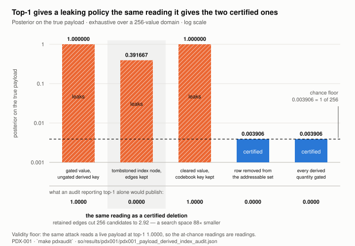
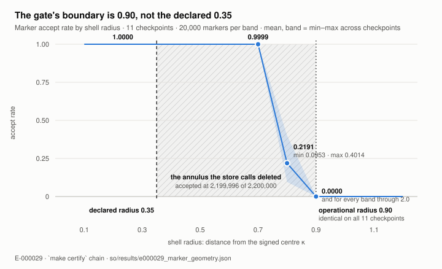
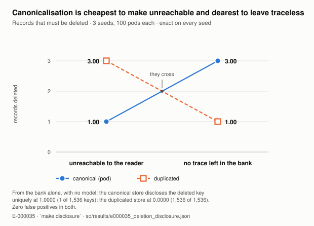

# Is "no attack recovered it" a deletion guarantee? A falsification, a construction, and what the construction costs

**Status: DRAFT. One item blocks submission — §13(a).** Every external citation has been checked
against its source (§0, `docs/paper/references.md`), though none has been reproduced. §13(b), (c)
and (d) are answered; (a) needs the symlink checkpoints, which means a training run.

*Revision 2, 2026-09-06: restructured around a single research question. Revision 1 was organised as
a list of seven findings, which is a record, not a paper. No number changed in the restructure.*

---

## 0. Two things a reader must know before the abstract

**External citations were unverified. All thirteen clusters now are — and checking the *negative* claims cost three of ours.** The literature positions in this
draft descend from a 41-agent literature workflow recorded in `docs/so-novelty-2026-09-04.md`, whose
own provenance note disclaims them: its claims about this repository were checked against
`so/results/*.json` and match, but titles, authors, venues, identifiers and reported numbers were
**not** independently checked.

This draft then repeated, for a day, that "nothing in the environment has network access". **That was
never tested and is false** — search and fetch both work here. **All thirteen clusters have now been
verified against the sources**, with status and method recorded per entry in
`docs/paper/references.md`; §12 carries the results. Where a source is quoted below, the quotation
has been read in the source's own text. Verification is bibliographic: no cited result has been
reproduced.

**And the harder half, which had never been done at all.** Verifying a citation checks a *positive*
claim. Every claim of novelty in this work is a *negative* one — "we could not find" — and until
2026-09-07 nothing had tested whether the search behind those nulls could find anything. NOV-005
calibrated it against propositions of known standing, then ran it on this paper's own claims. **It
took three.** F1's thesis was published two months earlier and is cited as prior art in §12; the
composition in §6 was proved at Eurocrypt 2020; and §2's general rule appeared three days before
this draft. What survives is narrower and is stated as such in each place.

**One item blocks honest submission: §13(a).** It is not optional, and it is compute rather than a
decision. §13(b), (c) and (d) are answered — see §13.

Every number attributed to this repository is from a committed record and is reproducible by the
`make` target named beside it.

---

## Abstract

Machine unlearning for memory-augmented language models is evaluated adversarially: delete, run
extraction or membership attacks, report that they failed. We ask whether that standard is a
guarantee, and if it is not, what replaces it and what the replacement costs.

**It is not.** We report a clean failure: a deletion primitive that passed four attacks at chance over
750 pooled trials and surrendered the deleted object at top-1 1.0000 to a fifth attack written
afterwards, through an index term derived from the very payload it destroyed. Restated over an
abstract store, the same channel reproduces in three unrelated shapes — **reconstructions of published
designs, not the published systems themselves** (§3, §13) — and in the vector-index shape it leaks
most of the payload while scoring **0.0000** on the very top-1 metric the first attack reported, so
the audit's own headline metric is also wrong.

**What replaces it is a proof.** Where knowledge is held in rows with a small payload domain,
independence of the model's computation from a deleted payload is provable exhaustively: sweep every
value the payload could hold and check nothing downstream moves. On a frozen 124M-parameter reader
this takes under a second and certifies deletions the attack standard could only call "not yet
broken". But a certificate is about a *record*, and nobody asks about records: it must compose with a
store-side closure, which is the database literature's **resilience**, computed here with a certified
lower bound.

**The replacement has a price, and it is the paper's sharpest result.** The arrangement that makes
erasure a single certifiable operation — canonicalising aliases into one record — **turns every
surviving access path into a deletion oracle**. From the store alone, with no model, an adversary
names the deleted key uniquely at 1.0000, where a duplicated store leaves the entire key space. The
construction we recommend in answer to the second question buys certifiability with exactly the
property an erasure guarantee exists to provide.

We do not claim the architecture, which is prior art — nor, after the NOV-005 citation audit, F1's
thesis or the composition, both of which have owners named in §12. The contribution is the audit and
four negative results with mechanism: specifically the measurement that the published instruments and
our own first attack both miss, a candidate-set posterior where a top-1 reading reports a clean
deletion.

---

## 1. The question, and how the paper answers it

> **Is "no attack recovered it" an adequate deletion guarantee for memory-augmented language models —
> and if not, what replaces it, and what does that replacement cost?**

Three sub-questions, and every section answers exactly one:

| | sub-question | answer | where |
|---|---|---|---|
| **F1** | Does the attack standard fail in a *demonstrable* case, not just in principle? | Yes — four attacks at chance, a fifth at 1.0000; and the standard's own metric fails too | Part I, §2–3 |
| **F2** | Can independence be *proved* instead of attacked — and over what? | Yes, exhaustively — but over a record, which must then compose with a store-side closure | Part II, §4–7 |
| **F3** | What does the construction cost that the attack standard never charges? | Certifiability is bought with disclosure: the design opens a deletion oracle | Part III, §8 |

The arc is falsification → construction → price of the construction. F3 is not an appendix to F2; it
is the reason the answer to F2 is not simply "canonicalise everything and certify".

**Why this question and not "is our architecture good".** It is not. An external addressable store
read by a frozen core, with per-entry lifecycle operations and a forgetting primitive, is prior art
at larger scale (Larimar; verified, `references.md` cluster 1). The system here is an instrument for asking F1–F3, not a proposal.

---

# Part I — F1: the attack standard fails, and so does its metric

## 2. A deletion that passes four attacks and loses to the fifth

The primitive SHRED destroys a cell's marker; a learned gate closes; the payload becomes unreadable.
Against it we ran a calibrated linear probe, forced choice, logit rank and top-1, on fresh seeds that
took no part in choosing the configuration. Forced choice landed on exactly 375 of 750. The probe on
4 of 750 against a chance of 1 in 256. Every exact interval contained its chance level — three of the
four carry one, logit rank being a statistic without an interval — **and the probe read live cells at
0.893–0.927**, so the attacks demonstrably worked where there was something to find. (`make
keychannel`, E-000019, **seeds 5–7**.)

Then one question none of the four asked. `shred()` writes only the marker and leaves the row ACTIVE,
and the routing keys are computed **before** the gate and never gated:

```
k_f = k_fwd(LN(s + r))          # subject and relation
k_r = k_rev(LN(o + r))          # THE OBJECT
v_f = v_fwd(o) * g              # only the values are gated
```

Give the attacker what the rest of the battery gives them — a cell's subject and relation — let them
locate its column from the routing of the ordinary forward question, then sweep candidate objects
through a *reverse* query and take the one that steers the read onto that column. Five seeds, 500
pooled targets, no training (E-000028):

**The fifth attack is a different experiment from the four, on a disjoint seed set.** The battery
above is E-000019 on seeds 5–7, held out from configuration selection, 750 trials; this table is
E-000028 on seeds 0–4 — the selection seeds — with 100 targets each. Held-out seeds are what makes an
*at-chance* reading evidence, and they do not bear on a recovery at 500 of 500, so nothing here rests
on the overlap. But the two rows are not the same trials and the paper should not be read as if a
fifth attack were added to the same battery.

| condition | object recovered top-1 | exact 95% interval | mean rank | winning margin |
|---|---|---|---|---|
| active (validity control) | 1.0000 | [0.9926, 1.0000] | 0.0 | 0.6195 |
| **shred** | **1.0000** | **[0.9926, 1.0000]** | **0.0** | **0.6195** |
| revoke / delete | 0.0040 | [0.0005, 0.0144] | 128.02 | 0.0022 |
| chance | 0.0039 | — | 127.5 | — |

The intervals are Clopper–Pearson over the 500 pooled targets. Only revoke/delete's contains the
chance level; shred's excludes it, which is the whole finding — and §9's rule makes an interval
load-bearing, so the table shows them rather than asking the reader to take the point estimates on
trust.

The shredded row is not leaky. It is *unchanged*: on every one of the five seeds the shred arm's
top-1, top-5, mean rank and margin are bit-identical to the active arm's, not equal to some number of
decimals. That is not a measurement, it is the mechanism — the tensors the attack reads are the same
object before and after, because `shred()` never touches them.

**This is not "soft-deleted data still on the medium."** The payload *was* gated; the value channel
*is* at chance; the recovery runs through a derived index the primitive never touched. The nearest
prior work (Ghost Vectors; verified, cluster 3) recovers *undeleted* embeddings from a
soft-deleting index. This is different in kind.

**The rule this yields:** enumerate every quantity derived from a payload and gate all of them, or
take the row out of the addressable set. It applies to any codebook key, memory address, scope
classifier, instance key, or vector index with a soft delete.

## 3. The channel is in the pattern, and top-1 cannot see it

§2 invites one objection: it is a note about one file's `k_rev`. We answer by restating the attack
over an abstract store — anything exposing rows, a deletion policy, and the observables derived from
a row — and doing both halves exhaustively over a 256-value payload domain: the **attack** (keep
every candidate consistent with what the store exposes) and the **certificate** (sweep the same
domain and check whether any observable moves at all). The two are the same statement, and the run
asserts they agree on every policy. (`make pdxaudit`, PDX-001.)

Validity floor: the same attack reads a *live* payload at top-1 1.0000, so the at-chance readings are
readings.

| policy | top-1 | candidates left | posterior on true payload | search-space cut | certified |
|---|---|---|---|---|---|
| gated value, ungated derived key | **1.0000** | 1.00 | 1.000000 | 256× | no |
| tombstoned index node, edges kept | 0.0000 | 2.92 | **0.391667** | **88×** | no |
| cleared value, codebook key kept | **1.0000** | 1.00 | 1.000000 | 256× | no |
| row removed from addressable set | 0.0000 | 256.00 | 0.003906 | 1× | **yes** |
| every derived quantity gated | 0.0000 | 256.00 | 0.003906 | 1× | **yes** |



*Figure 1 — the false negative. The bars are what is recoverable; the strip beneath them is what a
top-1 audit would publish. The shaded column leaks and reads 0.0000.*

**And here the standard fails a second time, at its own metric.** A soft-deleted index node that
keeps the adjacency list built from its own embedding **never names the payload** — top-1 flat at
0.0000 (Figure 1). Under §2's headline that is a clean deletion. It is not: the retained edges narrow
256 candidates to 2.92, a posterior of 0.391667 against a chance of 0.003906. **An audit reporting top-1
alone returns a false negative on precisely the arrangement most deployed systems use.** The
candidate-set posterior is not a refinement; it is the difference between seeing the leak and
certifying its absence.

**F1 is answered.** "No attack recovered it" fails as a guarantee in a demonstrable case, and the
metric conventionally used to report it fails alongside it.

**Scope.** These are faithful reconstructions of published *shapes*, written from their descriptions.
No published system is run here. See §13.

---

# Part II — F2: independence can be proved, but only over a record

## 4. What a certificate is, and what it costs to compute

`so/audit.py`. Three checks of increasing strength, and two guards that can fail.

**Differential.** Perturb the deleted payload, run the model twice with identical questions, compare
every tensor every submodule emits.

**Exhaustive.** The payload is an entity id, so the domain has 256 values. Sweep all of them. Not a
sample; every case.

**Interface.** Both models read the store in exactly one place. So if the *encoding* is bit-identical
across the whole payload domain, every downstream quantity is identical **for every possible query**
— multi-hop, reverse, phrasings nobody has written. The cost is one cheap encoding per payload value
and **no core forward pass at all**, which is why it took under a second on a 124M-parameter adapter.
The cost therefore does not scale with the core; it scales with the encoder and the payload domain.
We have not run it on a larger core, so "and it would be as cheap at 7B" is a prediction the argument
supports and no measurement here establishes.

The guards exist because reading source is how two defects entered the record. `check_mediation`
looks for an output that moves while the encoding holds still — which would mean the interface is not
the only path, and voids the certificate. `check_row_locality` checks whether one row's payload can
move another's encoding.

Three seeds, 3 targets, 1000 cells, payload domain 256, no training (`make certify`, E-000030).
**The two synthetic rows and the four frozen-GPT-2 rows do not share a scope**, and the table
below should not be read as though they did: the frozen-LM arm is **one seed** over **400 cells**
with the same 256-value payload domain. Extending it to three seeds is cheap and has not been
done.

| model | operation | certified for every query | first quantity that moves |
|---|---|---|---|
| synthetic | REVOKE | no (certified on 838 swept questions) | `encode_bank[v_f]` |
| synthetic | SHRED | no | `encode_bank[v_f]` |
| synthetic | DELETE | yes, structurally | the row is not in the bank |
| frozen GPT-2, soft gate | REVOKE | **CERTIFIED** | — |
| frozen GPT-2, soft gate | SHRED | no | residual 1.390e-02 |
| frozen GPT-2, hard gate | REVOKE | **CERTIFIED** | — |
| frozen GPT-2, hard gate | SHRED | **CERTIFIED** | — |

These are the first deletions here that are not "no attack recovered it". The computation is
bit-identical for all 256 values the payload could take, so no attack of this shape can exist.

The soft/hard split measures what the hard gate buys, which had been assumed: a sigmoid never returns
zero, so under the soft gate a shredded cell retains 1.390e-02 of its payload in the value; the hard
gate thresholds to exactly zero.

## 5. What a learned gate certifies is not what it was written to implement



*Figure 2 — the swept geometry. The declared radius and the operational one are 0.55 apart, and everything between them is accepted.*

A certificate over a *learned* predicate inherits the predicate's actual boundary, not its declared
one, and the gap is measurable.

The store declares a deletion radius of 0.35. Sweeping twenty shells of 20,000 markers over eleven
checkpoints (Figure 2): accept rate is 1.0000 out to 0.60, 0.9999 at 0.70 (min 0.9992 across
checkpoints), 0.2191 at 0.80 (min 0.0953, max 0.4014), and 0.0000 from 0.90 through 2.0. **The
gate's operational radius is 0.90 against a declared 0.35, identical on every checkpoint.** The
annulus the store's own predicate calls deleted is accepted at **2,199,996 of 2,200,000**, and no
training or evaluation distribution ever populated it, because both samplers reject inside 0.7.

The published false-accept rate of 8.49e-04 reproduces at 8.550e-04 *on the distribution it was
measured on*, and is not the false-accept rate of the thing being claimed.

That learned detectors fail adversarially is old (Carlini & Wagner; learned index structures needing
an exact backup filter; both verified, cluster 6). Demonstrating the specification-versus-boundary gap as a
**swept geometry on a deletion mechanism, with both rates side by side**, is what we could not find.
The fix is to the data, not the architecture: show the gate the predicate's boundary.

## 6. From record to fact: the certificate must compose with a store-side closure

§4 proves the computation is independent of a deleted **record**. Nobody asks that. They ask whether
the **fact** is gone, and the two come apart wherever the fact is reachable another way. This
repository holds the extreme case: `derivable_recovery_after_revoke_K3 = 1.0` in every seed — a
certified record deletion under which every derivable fact survives.

The gap closes by factoring the guarantee:

```
record-level certificate over R   +   R covers the fact's closure
─────────────────────────────────────────────────────────────────
                    fact-level certificate
```

The second premise is a property of the **store**, computed with a mechanical resolver and no model
at all. In a canonicalised pod the closure is **one record for any number of access keys**; under
duplication it is **exactly k**. Both proved rather than sampled: every live derivation is a must-hit
set, so a pairwise-disjoint subfamily bounds the optimum from below, and `optimal` is set only when
the greedy search *meets* that bound. (`make closure`.)

**What is not ours, and belongs in the first paragraph rather than in related work.** The quantity is
**resilience** in the database literature — the size of a **minimum contingency set**, with its own
PTIME/NP-complete dichotomy and an LP-tight solver in print. The certified lower bound is that
literature's standard disjoint-witness packing bound. And the remedy — canonicalisation at write time
— is proposed verbatim in §9 of a 2026 audit of forgetting in limited-memory language models, which
calls it "directly testable within our framework" and does not test it (both verified against their
sources; see `docs/paper/references.md`, clusters 4 and 5).

**And the composition is not ours either — corrected by NOV-005, 2026-09-07.** An earlier draft of
this section claimed the composition of a store-side guarantee with a record-level certificate over a
learned reader. Garg, Goldwasser and Vasudevan (Eurocrypt 2020) build exactly that and prove it: a
data collector that "maintains a dataset as a history-independent dictionary `Dict`" and calls
`delete(Dict, model, key)` on any learning algorithm equipped with a deletion operation, with
Theorem 3.4 bounding its 1-representative deletion-compliance error at `1/λ + poly(λ)/2^λ`. Cohen,
Smith, Swanberg and Vasudevan (CCS 2023) then fold the store-side and model-side definitions into
one. The programme's own novelty statement withdrew this claim on 2026-09-04; the withdrawal reached
that document and not this one, for three days.

What is ours in this section is the measurement, and the price the reader charges for the
indirection: 0.0954 for sharing and 0.0688 for link training, worst of three seeds over twelve
phrasings (`make rescore`, E-000025).

**Provenance caveat on those two numbers.** E-000025's own record notes that a forced re-run
overwrote the seed-0 and seed-1 checkpoints of E-000020 after that record was written; only seed 2
still matches the SHA-256 E-000020 recorded. E-000025 is internally sound — it stores the SHA of
every checkpoint it actually scored — but for two of three seeds those checkpoints cannot be traced
to E-000020, so §0's "reproducible by the `make` target beside it" holds for this pair only in the
sense that the scored artefacts are hashed, not that re-running the chain reproduces them. These are
the only two numbers in the paper with that qualification.

## 7. Why the construction needs rows at all

F2's answer depends on an architectural precondition that is worth isolating, because it is the only
thing the architecture is load-bearing for.

One frozen GPT-2, 400 facts, 50 deletion targets, three ways of holding and removing them, attacked
identically. The weights arms get a LoRA of 2,359,296 parameters against the adapter's 2,370,692 — a
1.00× match — trained until they answer 95% of the targets. (`make compare`, E-000024.)

**This table is one seed.** The record is seed 0 only; every aggregate in it has n = 1. It is the
weakest evidence in the paper and the easiest to strengthen — the three-seed run needs no new code.
Read the rows as a demonstration that the comparison is *available*, not as an effect size. The two
LoRA columns also share **one** before-deletion measurement (`weights/before/direct_acc` = 0.96), so
the 0.96 appears twice as one number, not as two agreeing ones.

| | cells (SHRED) | LoRA, gradient ascent | LoRA, relabel to ' unknown' |
|---|---|---|---|
| answered the fact before deletion | 0.92 | 0.96 | 0.96 |
| answers it after | 0.02 | 0.00 | 0.02 |
| forced choice, chance 0.50 | **0.44** | 0.78 | **1.00** |
| relearning attack recovers held-out facts | **0.00** | 0.48 | **0.72** |
| perplexity on ordinary prose, from 42.9 | **42.9** | 6.19e+09 | 6.39e+06 |
| parameters changed | **0** | 2,359,296 | 2,359,296 |
| seconds to delete 50 facts | **0.0008** | 129 | 335 |
| **a certificate is even available** | **yes** | no | no |

The relabel arm is the strongest practical baseline and the worst of the three: it looks deleted at
0.02, and an attacker who fine-tunes on half the deleted facts recovers 0.72 of the half they never
supplied.

The last row is the one that matters, and not because of effort: in a LoRA there is no finite payload
domain to sweep and no interface the data passes through. **Putting facts in rows is what makes
deletion certifiable at all** — which is the precondition F2's answer quietly assumes, stated
explicitly.

**That last row is an argument, not a measurement**, and it is the only cell in this paper's tables
that is. Every other verdict here — §3's `certified` column, §4's seven certificate cells — is bound
to a boolean in a record and re-read by `make papernums`. "A certificate is even available" is not
in any record, because no experiment could produce it: it follows from the absence of a finite
payload domain in a LoRA, which is a property of the representation and not an outcome we measured.
Read it as reasoning, and disagree with the reasoning if you can.

**F2 is answered.** Independence is provable, exhaustively and cheaply, given rows and a mediated
interface — but only over a record, and the fact-level statement needs a store-side closure the model
knows nothing about.

---

# Part III — F3: the construction is paid for in disclosure

## 8. Canonicalisation makes erasure certifiable and opens a deletion oracle

Part II ends by recommending canonicalisation: it makes the closure one record instead of *k*, which
is what lets a record-level certificate become a fact-level one. This section is the bill.

Delete one of *k* duplicated copies and the store is a store with *k−1* copies: nothing says a
deletion happened, nothing says where. Delete a pod's object and every alias is still a LINK row
still carrying the removed cell's key.

No model, no checkpoint, no training: the adversary reads the bank and names every key a LINK row
points at that no row holds. Three seeds, 100 pods each (`make disclosure`, E-000035):



*Figure 3 — the inversion. No store design is cheapest for both guarantees.*

| store | deleted key disclosed | uniquely identified | candidate keys left | false positives |
|---|---|---|---|---|
| **canonical (pod)** | **1.0000** | **1.0000** | **1 of 1,536** | 0.00 |
| duplicated | 0.0000 | 0.0000 | 1,536 of 1,536 | 0.00 |

And the closure **inverts** with the guarantee you ask for. **The two rows are two experiments**, and
only the second is the one this section is about: unreachability is E-000032 (`make closure`, three
seeds, **25 pods each**) and tracelessness is E-000035 (three seeds, 100 pods each). Both are exact
on every seed, so the inversion does not turn on the pod count — but it is a comparison across runs,
not two columns of one table.

| guarantee | canonical pod | duplicated | record |
|---|---|---|---|
| unreachable to the reader | **1.00** | 3.00 | E-000032, 25 pods/seed |
| no trace left in the bank | 3.00 | **1.00** | E-000035, 100 pods/seed |

A pod's aliases *are* the signposts, so leaving no trace costs the object plus all of them; a
duplicated store costs the one record you were removing anyway.

**So the recommendation of Part II must be stated in both directions: canonicalisation makes erasure
a single certifiable operation and turns every access path into a deletion oracle.** Both follow from
one design decision. And "was there a record about this person, and was it deleted" is exactly the
question an erasure guarantee is supposed to make unanswerable — so the construction buys
certifiability with the property it was meant to provide.

Blanking the dangling key closes the channel at 1.0000. The trade is a number, not an argument.

**F3 is answered**, and the answer constrains F2's: there is no configuration that is simultaneously
cheapest to certify and quietest to observe. A system must choose which guarantee it is offering, and
say which.

This is the result we expect to travel furthest: any store that keeps a dangling reference after
deleting its referent has it, which includes every soft-deleting vector index that keeps its edges.

---

## 9. Methods: an instrument that cannot fail is not evidence

Three instruments in this programme certified by *not testing*. Reachability on an empty row set
returned the strongest label in the ladder on a live bank. The payload sweep on an empty row set
certified in one evaluation. And a membership test could not see that an alias row's link key is
built *from the target cell*, so a surviving row is computed from the removed one. All three are
closed: reachability refuses an empty row set, absence needs a positive control showing the payload
*was* reachable, and store-absence sweeps the payload over its whole domain.

We state the rule as a methods contribution because we have now paid for it five times, and because
the evaluation literature this paper joins is built almost entirely from instruments of this shape:

> **An instrument that cannot fail is not evidence. Every screen needs a positive control, and every
> attack needs a validity floor.**

Every measurement in this paper carries one. §2's probe reads live cells at 0.893–0.927. §3's attack
recovers a live payload at 1.0000 and refuses to report if it does not. §4's certificate has two
guards that can void it. A mechanical sweep of all 106 recorded experiments for comparisons whose two
sides share a source found three — and the sweep's own first run failed its floor and had to be fixed
before its silence anywhere else meant anything.

This is the half of the unlearning-evaluation problem that attack-based benchmarks leave open, and it
is cheap.

**The rule applies to the paper too.** Drafting this produced three disagreements between the prose
and `so/results/`, and each was caught by a person opening a JSON file: a mean rank written 128.0
where the record says 128.02; an accept rate written 1.0000 where the sweep says 0.9999; and §7's
table presented with no seed count where the record is one seed. Three for three is the absence of
an instrument, so there is now a registry (`make papernums`) binding 112 figures printed in this text
and 31 more printed inside the three drawn figures to the record paths they came from, re-rendered
under the rounding rule used, plus 19 **verdicts** — categorical cells like `CERTIFIED`, each
bound to the record boolean behind it and checked against its own table row — and 10 **scope
claims**, a fact about a record's extent that this text must state in words, which is what
caught §7. It fails when prose and record part. Its own floor
mutates each registered figure and requires the check to notice, for all of them rather than a
sample, since a claim whose path silently failed to resolve would pass a clean run too.

**Four more disagreements then survived it, and that is the most useful thing the registry has
done.** A read-through found §7's prose claiming a relearning attack recovered "76%" where the record
says **0.72**, and three scope errors: §2 presenting one battery when it is two experiments on
disjoint seed sets, §8 combining a 25-pod experiment and a 100-pod one under one heading, and §6
quoting two numbers whose checkpoints the record itself flags as no longer traceable. The check was
green throughout — because none of the four was registered.

**So we measured how partial "partial" was, and it was worse than the four.** `unregistered()` takes
every numeric token in this text, strips the ones that are not measurements (each exclusion carries
its reason, so the list can be argued with rather than trusted), and reports the remainder. On its
first run **45 of 95 distinct numbers were bound to nothing at all** — including almost the whole of
§7's table, where it immediately turned up three more wrong figures: `137` seconds, which is
E-000024's *mean rank* of 137.2 read off the wrong row; `311` seconds, which appears nowhere in the
record; and a perplexity of `8.49e+06`, which is not in the record either and borrows §5's
false-accept mantissa. The record says **129**, **335** and **6.39e+06**.

Coverage is now **zero unbound**, and `make papernums` fails if that changes. Two further things the
check now does to itself: the numbers in this very paragraph — how large the registry is — are the
one set that cannot be bound to a record, since their source is the registry, so they are compared
against `len()` instead; and they had already drifted three times before that check existed. What
remains true is the general form: a green run is a statement about the bindings that exist, and the
bindings that exist are the ones somebody thought to write. The difference is that the paper now
reports how many that is.

**Then two kinds of claim that were not numbers at all.** The tables also have verdict columns —
`CERTIFIED` four times in §4, `yes`/`no` five times in §3 — and nothing bound any of them; a wrong
decimal misstates a magnitude, a wrong `CERTIFIED` misstates whether the central claim holds. All
nineteen are now bound to the record boolean behind them, each checked against **its own table row**,
since `CERTIFIED` appears four times and a document-wide test would let any of them pass on
another's evidence. Sweeping for verdict rows also found one that cannot be bound and should not
be — §7's "a certificate is even available", which follows from a LoRA having no finite payload
domain rather than from any measurement, and which had been sitting among six measured rows looking
identical to them.

**And one that went stale without anyone touching the paper.** The base branch gained six
experiments overnight, so a sweep of all `100` recorded experiments became one of `106` — a claim invalidated
by the *repository* growing, not by an edit. The check stayed green through it for an instructive
reason: `100` is five different quantities in this text (targets per seed, pods per seed, the swept
count), only one was bound, and its presence test found some occurrence and passed. A figure "round
enough to recur" was not merely undiscriminating, it was actively concealing. Claims that render
identically are now pinned to the paragraph naming which quantity they are, and the swept count is
bound to the sweep's own record so it tracks the repository rather than the prose. (The six new
experiments were themselves clean: no new instance of either defect class.)

And finally: **do the pointers point at anything?** §0 promises every number is reproducible by the
`make` target named beside it, and a target that does not exist makes that promise false in a way no
amount of correct arithmetic would reveal. All forty pointers now resolve — every backticked `make`
target against the Makefile, every cited experiment against `so/results/`, every §-reference against
this paper's own headings, every quoted path and embedded figure against the disk. The one finding
was structural rather than broken: **E-000033 is the only experiment identifier here with no record**,
because it has never been run, and citing it is honest only because §13(b) says so in those words —
which the check now requires.

Calibrating it made the same point a third time. Its presence test began as a substring search,
which is nearly vacuous for a short token — `0.0` is inside `0.0040` — and requiring a standalone
match immediately found two figures it had been passing on a coincidence. For a figure round enough
to recur (`1.0000`, `256`) the test still does not discriminate, and those are reported weak rather
than counted. What remains unclaimed: the registry is partial by construction, so a figure not in it
is unchecked rather than verified; on the drawn figures it reads the numbers a reader sees and not
the geometry that places them, so a bar drawn at the wrong height with the right label passes — one
was, and a render caught it, not the check; and it compares this paper against the records, never
the records against reality, so a wrong number written identically in both would pass.

## 10. What this is not

The architecture is re-invention (§1). The word "provably" is not earned for the copy-bound claim:
absence of a fact is not demonstrable from weights, only from the training algorithm, and that
argument belongs to prior work.

The certificate is about the **model**, not the system: after REVOKE or SHRED the store still holds
the payload, and anyone who can read the store does not need the model. It is exhaustive over the
payload domain and universal over queries only through the interface argument, which is a claim about
a specific model that the mediation guard can refute but not establish.

The fact-level guarantee is **unreachability, not erasure**; it is over a **declared query
workload** — the default is one single-hop question per key, and §6's counterexample shows a
multi-hop derivation outside it is not hypothetical; and it individuates a fact as a **triple**, so
canonicalising one subject's pod says nothing about the same value under another subject.

Everything is CPU, 124M parameters, synthetic worlds, single-token entities. **Nothing here shows
unlearning of knowledge already in pretrained weights** — that is precisely what the architecture
avoids rather than solves. §13(c) is the experiment that would make the scale of this setup
irrelevant, by making it the instrument rather than the subject.

## 11. Contributions

**Answering F1.**
1. A payload-derived index channel that defeats a value-gating deletion primitive at top-1 1.0000
   while every value-channel attack sits at chance, with the generalisable rule and a
   store-independent instrument reproducing it in three shapes (§2, §3).
2. The demonstration that top-1 recovery is the wrong metric for this audit and the candidate-set
   posterior is required — on the vector-index shape, where top-1 reads 0.0000 and the search space
   is cut 88× (§3).

**Answering F2.**
3. Exhaustive record-level deletion certificates for a frozen memory-augmented reader, and the
   soft/hard gate measurement (§4).
4. The specification-versus-learned-boundary gap as a swept geometry on a deletion mechanism, with
   both false-accept rates side by side (§5).
5. The composition of a record-level certificate with a store-side closure, with a certified lower
   bound, and the price of the indirection (§6); and the isolation of rows as the precondition that
   makes any certificate available (§7).

**Answering F3.**
6. **Canonicalisation makes erasure a single certifiable operation and turns every access path into a
   deletion oracle** — measured from the bank alone, no model (§8).

**Methods.**
7. A rule with five worked instances, including three in this programme's own instruments (§9).
8. The rule turned on the write-up itself: a machine-checked binding from every figure printed here —
   in the prose and inside the drawn figures — to the record it came from, with scope claims for
   extent, and a floor that mutates each binding to prove the check can fail (§9).

## 12. Related work, in one place

Consolidated here rather than distributed. **All thirteen clusters are verified against their
sources**, with the method and status of each in `docs/paper/references.md`. Clusters 9-13 were added
by NOV-005 on 2026-09-07 and three of them change a claim rather than support one.

**Memory-augmented architectures with per-entry lifecycle operations.** Das et al., *Larimar: Large
Language Models with Episodic Memory Control*, ICML 2024 (arXiv:2403.11901) — one-shot updates
without retraining, with selective fact forgetting. This is why §1 concedes the architecture.

**The discrete codebook whose key is derived from the content it indexes.** Hartvigsen et al.,
*Aging with GRACE: Lifelong Model Editing with Discrete Key-Value Adaptors*, NeurIPS 2023
(arXiv:2211.11031). GRACE caches edits keyed by the original embedding, which is precisely the shape
PDX-001's `codebook_key` policy reconstructs — so that row models a real design, not an invented one.

**Recovery of soft-deleted embeddings.** *Ghost Vectors: Soft-Deleted Embeddings Remain
Reconstructible in HNSW Vector Databases*, 2026 (arXiv:2606.18497). The nearest prior work, and
**different in kind**: it recovers embeddings a soft delete left physically on disk, read beneath
the API. §2's payload *was* gated and its value channel *is* at chance; the recovery runs through a
derived index term. That distinction survived checking.

**The audit that proposes our remedy and does not test it.** Raeesi and Roed, *Auditing Forgetting
in Limited Memory Language Models*, July 2026 (arXiv:2607.00605). Its §9 proposes storing "aliases
and paraphrastic forms as pointers into a single canonical record" and calls it "directly testable
within our framework" — read in the source, in Future Work, unimplemented, with no closure size and
no closure-finding cost measured. Its own finding, that the unlearning boundary "is drawn primarily
by the database administrator rather than by the model", is independent support for §6's
record-versus-fact distinction and is cited here for that as much as for the untested proposal.

**Resilience and minimum contingency sets.** The quantity §6 computes is the database literature's:
the minimum set of tuples whose removal falsifies a Boolean query, with PTIME/NP-complete dichotomy
results for self-join-free conjunctive queries and beyond (e.g. arXiv:1907.01129, arXiv:2601.05346).
The certified lower bound is that literature's disjoint-witness packing.

**Adversarial failure of learned predicates.** Carlini and Wagner, *Towards Evaluating the Robustness
of Neural Networks*, IEEE S&P 2017 (arXiv:1608.04644); Kraska et al., *The Case for Learned Index
Structures*, SIGMOD 2018 (arXiv:1712.01208). §5's analogy holds exactly: a learned Bloom filter keeps
an **exact backup filter** over the keys the model scores below threshold, so that no false negative
survives.

**Attack-based unlearning benchmarks, and a critique that sharpens F1 rather than agreeing with it.**
The standard is real: TOFU (arXiv:2401.06121), WMDP (arXiv:2403.03218) and MUSE (arXiv:2407.06460),
the last of which lists *no privacy leakage* among its six desiderata — an attack-based criterion.
Diamant, Glazer and Fetaya, *Stress Testing Unlearning Algorithms* (arXiv:2608.22527), object that
these benchmarks "do not actively test whether unlearned information can still be forcibly
extracted", and propose attacking harder.

**F1 says attacking harder is not the fix** — and F1 is not ours to claim, per the NOV-005 correction
immediately below. §2's fifth attack was written *after* the four returned
at chance; the space of attacks is not closed, so no quantity of adversarial effort converts "not yet
broken" into a guarantee. Only a proof over the payload domain does. That critique is therefore two
things at once: independent evidence that the standard is the standard, and an instance of the
response this paper argues is insufficient.

**F1's thesis is not new, and NOV-005 found who had it first (2026-09-07).** Yang and Yeung,
*Unlearning as Distribution Restoration* (arXiv:2607.19442, 21 July 2026), state it as a section
heading — "the adversarial boundary: forward-only certification is not sound" — and demonstrate it:
a fixed-magnitude logit-suppression penalty "lands the forget-answer NLL within family tolerance, and
the entire forward battery accepts a suppressed model" in **12 of 45 cells**, on a model whose
knowledge is intact. That is F1, reached independently two months earlier, across five architecture
families, with a positive control this paper cannot match. It must be cited as prior art and not as
agreement. What it leaves open is exactly this paper's remaining half: it calls its own result "an
empirical selective test for methods-as-produced, not an adversarially sound certificate", and
proposes no construction to replace what it falsifies. F2 is that construction, and §2's channel is a
mechanism their forward battery would not see either — it recovers through a term that never holds
the payload, so no elicitation of the payload can reach it.

**Masked-value training and corpus isolation for the copy bound.** *Provably Confidential Language
Modelling* (arXiv:2205.01863): Confidentially Redacted Training screens the corpus into public and
private sets and masks repeated sentences, yielding a provable confidentiality guarantee **from the
training algorithm**. That is exactly why §10 declines the word "provably" for the copy bound here
and attributes the argument to prior work.

**Derived artifacts surviving a plaintext-layer delete.** Yao et al., *Forgetting Without Restarting:
Execution-State Unlearning for Stateful LLM Agents* (arXiv:2609.04875, 4 September 2026). Deployed
stacks "offer only a forgetting affordance that operates on *plaintext at a single layer*", and
deleting the memory record "leaves leakage *exactly* unchanged from doing nothing" — summaries, plans
and KV tensors keep it, with behavioural extraction in 80–100% of episodes at zero string matches.
**§2's general rule is theirs**, and §2 should be read as the narrower case their setting does not
cover: an index term that holds no payload and names none, recovered by a measurement their binary
reading would score at 0.0000.

**Deletion certificates for language-model memory.** Ramesh, *Subtract, Transport, or Replay?
Auditable Deletion from Language-Model Memory* (arXiv:2607.27539, July 2026), audits deletion from a
frozen model's persistent memory with intermediate arrays inspected — "zero residual on final logits
and all 80 audited KDA arrays" — at 1B, 4B and 12B. §4 is not the first certificate in this line. The
distinction it keeps is the kind: that work verifies a **recomputation** and still leans on
behavioural attacks reaching never-stored baselines, where §4 sweeps the **entire payload domain**.
The cryptographic line (arXiv:2210.09126, arXiv:2210.11334) proves absence from the *training set*,
which is provenance rather than computation.

**And one place the prior art stops.** *MERIT* (arXiv:2607.29173) studies exactly the structure §3
and §8 exploit — after a vertex is deleted the index "does not know which other vertices contain
outgoing edges to it" — purely as a cost: stale edges "consume search capacity". No disclosure claim
appears in it. That a proximity graph's surviving adjacency is an information channel about the
deleted row, and that top-1 cannot see it, is not claimed there.

## 13. What must be run before this is honest to send

**(a) The payload-derived sweep on the symlink arms.** §2's attack has never been run on the aliasing
arms, so §8's "nothing recoverable" is value-channel-only for those arms. Named as still-unrun in the
2026-09-04 record; still unrun.

**(b) The closure reproduced in a chunked vector index.** Until §6's closure is shown in the
arrangement almost every deployed system uses, the result is about one store implementation rather
than about the pattern. **The target has now been run, and it fails its own pre-registered control**
(`make retrieval`, E-000033: three seeds, 150 facts, 4 chunks each, frozen GPT-2 as the embedder).

The experiment requires both arms to *answer* before any deletion — "or the comparison is between a
working store and a broken one" — at a registered threshold of **0.80**. Observed: **0.0467** mean,
**0.0250** on the worst seed. Mean-pooled GPT-2 embeddings do not retrieve the right chunk out of
600. The falsification condition the experiment wrote for itself fired.

**So that run's two data columns must not be read.** They look like the result: closure `1.00`
canonical against `4.00` duplicated. Reporting them would be this programme's own §31.15 failure in
its purest form — a comparison between two stores, neither of which can be read from.

**The substance is nonetheless established, by a separately registered experiment (PDX-003).**
E-000033's failing record stands as recorded and is not amended. PDX-003 imports E-000033's protocol
— its facts, its twelve templates, its index construction, its read test, its closure search — and
changes **exactly one declared thing**: the encoder, `all-MiniLM-L6-v2` instead of mean-pooled
GPT-2. A causal LM's mean-pooled hidden state is not a retrieval representation and was never
trained to be one.

Three seeds, 150 facts, 4 chunks each. Every registered criterion passes:

| | canonical | duplicated |
|---|---|---|
| answers before deletion | 0.8967 | 0.9350 |
| chunks holding the fact | **1.00** | **4.00** |
| still retrievable after one deletion | **0.1333** | **0.9867** |

The control E-000033 failed at 0.0250 is met at **0.8800 on the worst seed**. **§6's closure
reproduces in a chunked retrieval store**: deleting the chunk a fact's own question retrieves removes
the fact canonically and leaves the duplicated store answering almost always.

**What that does not show.** Swapping a component of a pre-registered experiment until it passes is
the move this programme distrusts, so PDX-003 carries its own registration rather than inheriting
E-000033's, and the swap is one function. It shows the closure survives in a retrieval store *when
the store can be read*. It does **not** show that E-000033's own configuration was sound.

**(c) Done. The instrument has been run against a real index (PDX-002).** This item asked for §3's
audit to be pointed at a published system rather than a reconstruction, and predicted the
restructured PDX-001 would make that configuration rather than a rewrite. It did.

**System under test: `hnswlib` 0.8.0**, the reference HNSW implementation, from PyPI, used as
documented — nothing patched or reimplemented. Payload domain 256, 16 targets, validity floor met,
clean control clean.

| policy | top-1 | candidates left | posterior |
|---|---|---|---|
| live (validity floor) | **1.0000** | 1.00 | 1.000000 |
| `mark_deleted`, public API | **1.0000** | 1.00 | 1.000000 |
| `mark_deleted`, disk access only | **1.0000** | 1.00 | 1.000000 |
| rebuilt without the row | 0.0000 | 256.00 | 0.003906 |

**The reconstruction understated the real thing.** §3 modelled the tombstone as a *partial* channel:
retained adjacency narrowing 256 candidates to 2.92, posterior 0.391667, invisible to top-1. The
reference implementation needs no partial channel. Its API is consistent — after `mark_deleted`,
`get_items` raises and `knn_query` never returns the label, across a save/load round trip — but
`unmark_deleted` is a **documented public call** that returns the payload exactly, and the exact
bytes remain in the serialised index for anyone with the disk.

**This is not a vulnerability report and the paper must not be read as making one.** `mark_deleted`
is specified as a reversible tombstone, shipped with `unmark_deleted`, and is the correct primitive
for capacity reuse. The claim is about **deployments that discharge a deletion request with it**. No
hosted service was touched and no vendor product was tested.

**What it changes for this paper.** F1's rule — enumerate every quantity derived from a payload and
gate all of them, or take the row out of the addressable set — is no longer supported only by our
own store and reconstructions of published shapes. The right-hand disjunct is exactly what the clean
control does here (`rebuild_without_row`), and it is the only arm that reaches chance. It also
answers the reviewer who objects to the scale of our setup: that setup is now the instrument rather
than the subject.

**(d) Done, bibliographically. All thirteen clusters are verified, and the audit went the other way.** This item said the references had
to be found before they could be verified, and that the environment had no network to find them
with. The second half was false and untested. §12 now carries real works, with per-entry method and
status in `docs/paper/references.md`; the two claims the argument most depends on — Ghost Vectors
being different in kind, and the 2026 audit proposing canonicalisation without testing it — were
read in the sources and both hold.

**And then the negative half, which (d) as written did not ask for.** Verifying a citation tests a
claim that something *exists*. Every novelty claim here tests that something *does not*, and nothing
had ever checked whether the search behind those nulls could find anything at all. NOV-005 calibrated
it — three propositions of known standing, all of whose prior art it returned, plus a fabricated
construct it correctly failed to find — and then ran it on this paper. It withdrew two claims and
narrowed two more, including F1's thesis. Clusters 9–13 of `references.md` are the result, and three
of the five change a claim rather than support one. `make novelty` re-runs it and **exits non-zero if
a withdrawn claim is still asserted anywhere in this draft**.

**What (d) does not cover: no cited result has been reproduced.** A citation can be real, quoted
accurately, and still misread. The check that would catch that is (c). And a null here means "these
queries did not find it": the queries are in the record so a reviewer can beat them.

## 14. Venue

Not an architecture paper. A short measurement-and-audit paper. §6 and §8 are what a reviewer will
weigh; §2 and §3 are what a practitioner will act on.

**Target: IEEE SaTML 2027.** Abstract 22 September 2026, full paper 29 September 2026 (both 11:59pm
AoE), decisions 16 December, conference Reykjavik 8–10 May 2027. Research papers run to 12 pages of
body text, double-blind, and **artifact evaluation is required** — artifacts shared within three days
of the deadline and deposited on Zenodo if accepted.

**Why this venue.** Its scope covers novel attacks, privacy in machine learning, machine-learning
system security, and verification of algorithms and systems: §2 and §3 are an attack, §8 is a
privacy disclosure, and §4 is verification. **Be aware of the gap**: the call does not name machine
unlearning, deletion or the right to be forgotten explicitly, and data auditing appears only
obliquely under trustworthy data curation. That is an argument the submission has to make rather
than assume.

**The artifact requirement is an advantage here, not a cost.** Every number is bound to a committed
record, `make papernums` fails when the prose and the records part, and the whole chain is
reproducible from `make` targets that CI runs on every push.

**What still blocks submission: §13(a) alone.** (b) is answered by PDX-003, (c) by PDX-002, and (d)
is complete. (a) needs the symlink checkpoints, which means a training run — not a decision, just
compute.

---

### Reproduction

Every number above: `make keychannel certify closure retrieval disclosure compare pdxaudit`. Records
in `so/results/`. Instrument audits: `make calibrate charged unread auditinstr`. To check this text
against those records: `make papernums` (112 figures in the prose, 31 in the drawn figures, 19 verdicts, 10 scope
claims; non-zero exit when any of them parts from its record).
